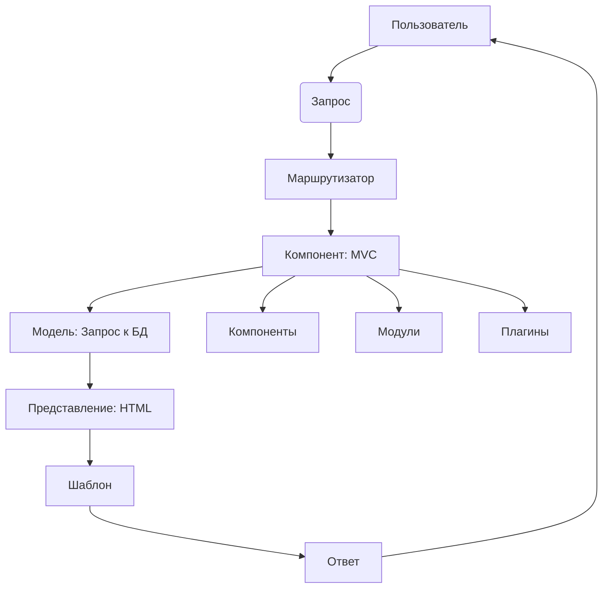

# PHP приложение

Система управления контентом с модульной архитектурой, основанной на MVC (Model-View-Controller).

## Схема потока данных

```mermaid
flowchart TD
    A[Пользователь] --> B(Запрос)
    B --> C[Маршрутизатор]
    C --> D[Компонент: MVC]
    
    D --> E[Модель: Запрос к БД]
    E --> F[Представление: HTML]
    F --> G[Шаблон]
    G --> I[Ответ]
    I --> A

    %% Добавленная группа компонентов, модулей и плагинов
    
    D --> K[Компоненты]
    D --> L[Модули]
    D --> M[Плагины]
```
